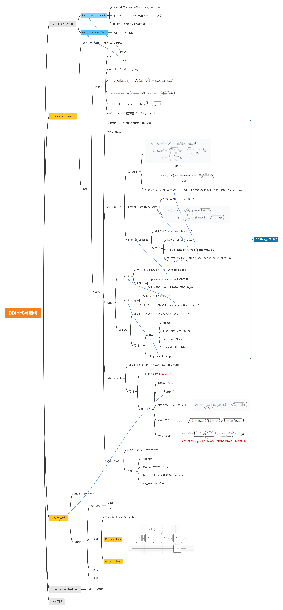

## DDIM
参考地址：https://github.com/xiaohu2015/nngen/blob/main/models/diffusion_models/ddim_mnist.ipynb
说明：该项目利用DDIM实现手写数字识别。

### 1.代码逻辑导图

### 2.所需知识点
+ 正弦位置编码：https://www.zhihu.com/question/347678607
+ ResNet
+ 注意力机制

## Condition_Diffusion_model MNIST
参考地址：
https://github.com/TeaPearce/Conditional_Diffusion_MNIST
说明：条件扩散模型(classifier-free) 实现手写数字识别

